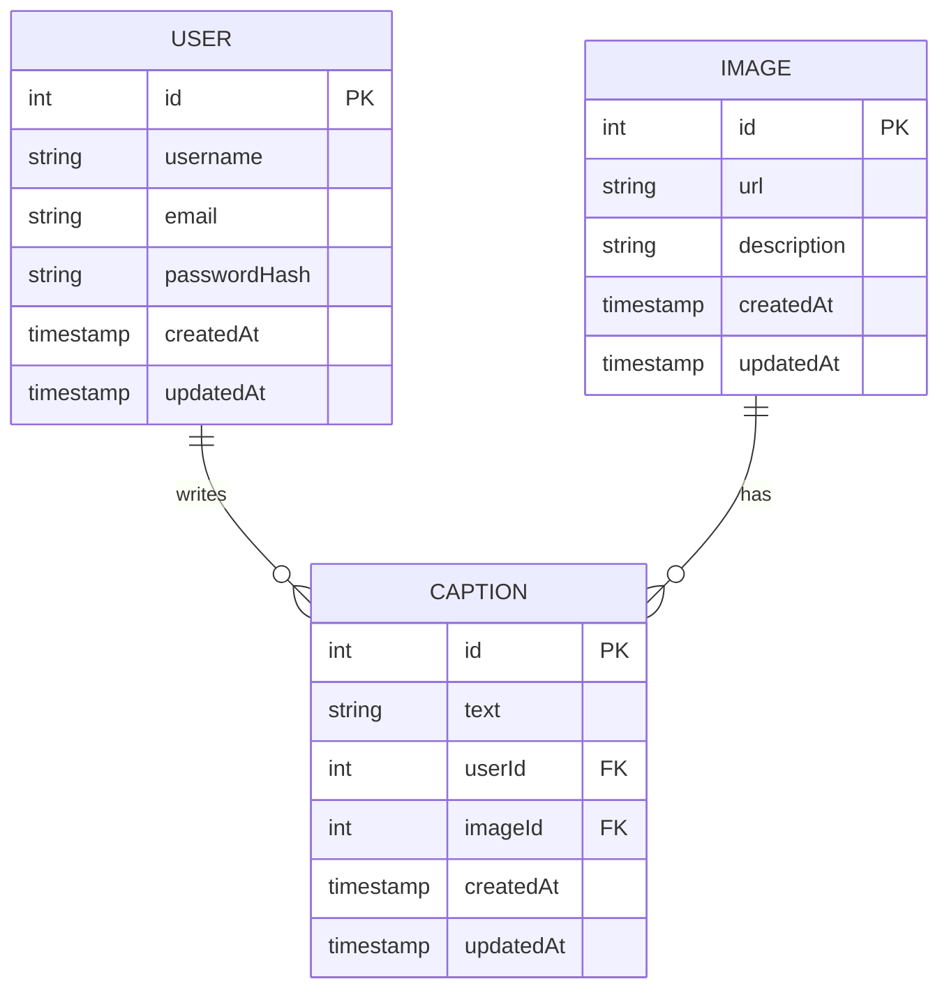

# Database Schema: Photo Caption Contest

## Tables & Relationships

### User
- `id` (PK, integer, auto-increment)
- `username` (string, unique, not null)
- `email` (string, unique, not null)
- `passwordHash` (string, not null)
- `createdAt` (timestamp)
- `updatedAt` (timestamp)

### Image
- `id` (PK, integer, auto-increment)
- `url` (string, not null)
- `description` (string, optional)
- `createdAt` (timestamp)
- `updatedAt` (timestamp)

### Caption
- `id` (PK, integer, auto-increment)
- `text` (string, not null)
- `userId` (FK → User.id, not null)
- `imageId` (FK → Image.id, not null)
- `createdAt` (timestamp)
- `updatedAt` (timestamp)

## Relationships
- **User 1---N Caption**: A user can submit many captions.
- **Image 1---N Caption**: An image can have many captions.

## ER Diagram

